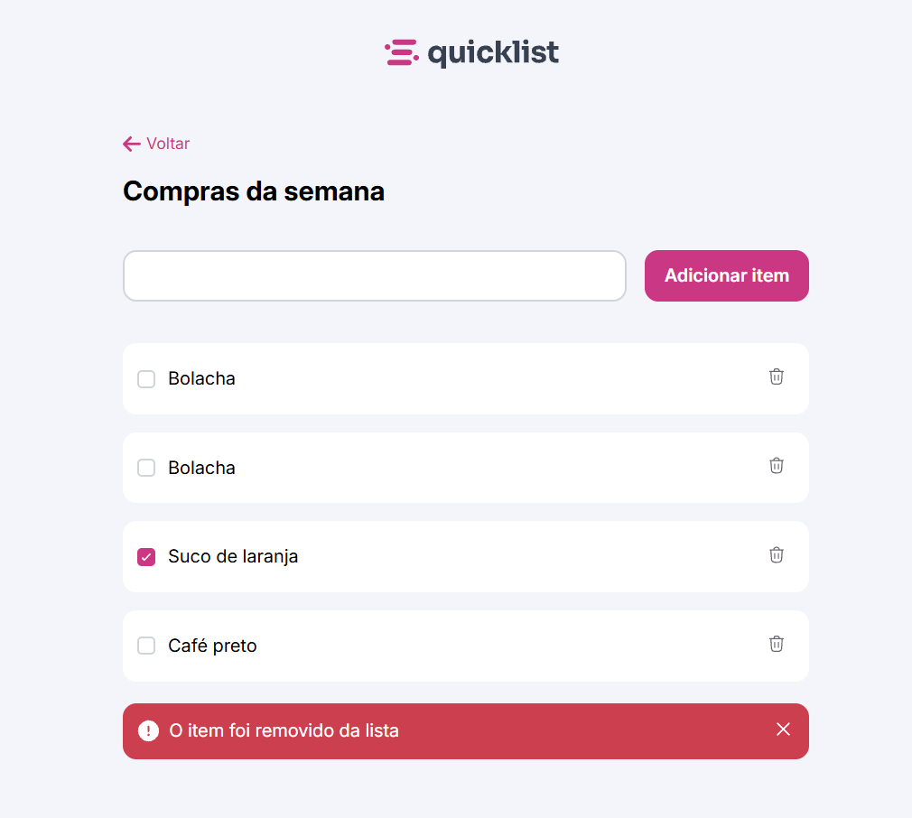

# 🛒 Lista de Compras

Projeto desenvolvido como parte do módulo de **JavaScript básico** do programa **Explorer** da [Rocketseat](https://www.rocketseat.com.br/), com o objetivo de praticar a criação de listas dinâmicas com interação via DOM.

## 📋 Descrição

Esta aplicação permite que o usuário adicione itens a uma lista de compras, com campos de nome e quantidade. Cada item pode ser removido individualmente da lista com um clique. O foco do desafio está no uso dos fundamentos do JavaScript: manipulação do DOM, eventos e lógica de programação.

## ✨ Funcionalidades

- Adicionar novo item com nome e quantidade
- Remover itens individualmente
- Validação de campos vazios
- Feedback visual com mensagens dinâmicas

## 🛠 Tecnologias utilizadas

- HTML5
- CSS3
- JavaScript

## 🎯 Aprendizados

- Manipulação de elementos com `createElement`, `appendChild` e `remove()`
- Eventos de clique
- Uso de funções e arrays
- Boas práticas na organização do código

## 🌐 Acesse o projeto online

🔗 [Clique aqui para visualizar](https://kauasilvandrade.github.io/shoppingList /)

## 📸 Imagem do projeto

## 📌 Status do projeto

✅ Projeto finalizado e publicado.

## ✍️ Autor

**Kauã da Silva Andrade**  
[LinkedIn](https://www.linkedin.com/in/kauã-andrade-6440a9225)  
[GitHub](https://github.com/kauasilvandrade)